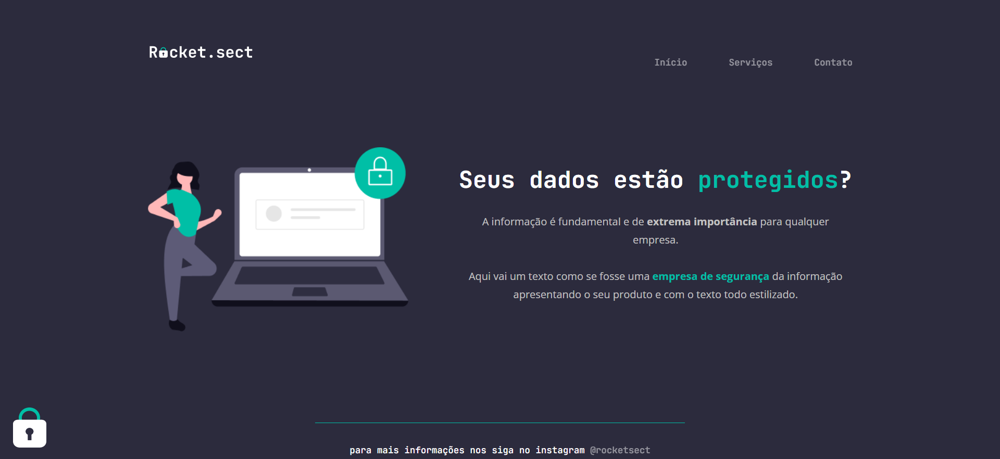

# Rocket.sect

O Rocket.sect é uma página simples desenvolvida dentro do programa Explorer da Rocketseat com o intuito de recriar uma aplicação HTML e CSS a partir de um layout previamente definido.

## :wrench: Tecnologias

- HTML
- CSS

## 📝 License

Este projeto está licenciado sob a Licença MIT - consulte o arquivo [LICENSE](LICENSE) para mais detalhes.

---

Feito com 💜 por Victor Nascimento
